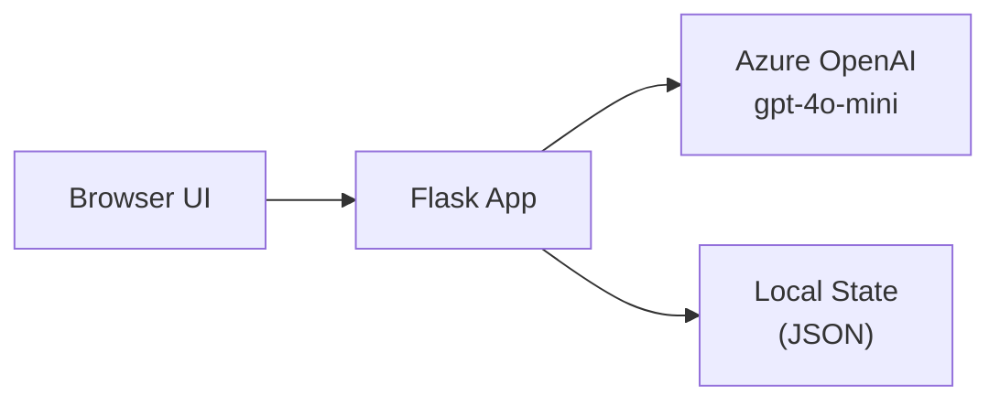

# Improvement Patterns

High-impact features to recommend based on demo type. Each pattern includes the trigger condition, the recommendation, why it matters, and how to implement it.

Evaluate all patterns against the user's intake answers. Present only those that are relevant and not already implied by the demo idea.

---

## Pattern 1: Server-Sent Events (SSE) Real-Time Streaming

**Trigger:** Demo has a multi-step processing pipeline (classification, extraction, search, etc.) that takes >2 seconds.

**Recommendation:** Add Server-Sent Events to stream live status updates to the browser.

**Why it matters:** Audiences disengage with loading spinners. Real-time status ("Classifying document... Extracting fields... Generating embeddings...") keeps attention and makes the AI feel alive and transparent.

**Implementation:**
```python
# Flask SSE generator pattern
def process_stream(file_data):
    def generate():
        yield f"data: {json.dumps({'status': 'Starting...'})}\n\n"
        # ... processing steps ...
        yield f"data: {json.dumps({'status': 'Done', 'result': result})}\n\n"
    return Response(generate(), mimetype='text/event-stream')
```

---

## Pattern 2: DefaultAzureCredential (Keyless Auth)

**Trigger:** Demo requires any Azure service (OpenAI, Search, Storage, etc.).

**Recommendation:** Use `DefaultAzureCredential` instead of API keys.

**Why it matters:** No API keys in `.env` files means no credential rotation, no "oops I committed my key" moments, and a cleaner demo setup story. Audiences immediately ask how auth works — this is the right answer.

**Setup requirement:** `az login` + RBAC role assignment (covered in Bicep via role assignments).

---

## Pattern 3: Architecture Diagrams (Mermaid)

**Trigger:** Always — every demo benefits from this.

**Recommendation:** Include `ARCHITECTURE.md` with Mermaid diagrams: component architecture, data/request flow, and (if applicable) sequence diagram for key workflows.

**Why it matters:** Technical audiences want to understand the system before they trust it. A 30-second read of a Mermaid diagram saves 10 minutes of explanation.

**Template:**


---

## Pattern 4: "How It Works" Collapsible Panel

**Trigger:** Demo has a non-obvious processing pipeline or multi-step AI workflow.

**Recommendation:** Add a Bootstrap `<details>` / accordion panel explaining the processing tiers in plain language.

**Why it matters:** Enables self-guided exploration after the demo ends. Audiences who run it themselves hit the panel first and immediately understand what's happening.

---

## Pattern 5: Structured Output Enforcement

**Trigger:** Demo uses LLM output for downstream logic (classification, extraction, schema discovery, etc.).

**Recommendation:** Use `response_format: { type: 'json_schema', json_schema: {...} }` to enforce structured output at the token level.

**Why it matters:** Eliminates JSON parse failures entirely. No truncation, no missing keys, no manual retry logic. Audiences ask "what if the model returns bad JSON?" — the answer is "it can't."

---

## Pattern 6: Per-Field Confidence / Transparency

**Trigger:** Demo involves extraction, classification, or any judgment call by the model.

**Recommendation:** Surface confidence scores or reasoning alongside results.

**Why it matters:** Trust-building. Technical audiences ask "how do you know it's right?" — showing a 94% confidence score with per-field reasoning answers that question immediately.

**Example output shape:**
```json
{
  "document_type": "Invoice",
  "confidence": 0.94,
  "fields": [
    {"name": "invoice_number", "value": "INV-2024-001", "confidence": 98},
    {"name": "total_amount",   "value": "1,250.00",      "confidence": 95}
  ]
}
```

---

## Pattern 7: Self-Evolving / Adaptive Component

**Trigger:** Demo involves document processing, classification, or pattern recognition.

**Recommendation:** Add a discovery path where unknown inputs trigger schema/pattern creation with human-in-the-loop approval.

**Why it matters:** The "wow moment" for most AI demos is watching it handle something it's never seen. A static classifier is expected — one that *learns and adapts* is memorable.

**Reference implementation:** `DocumentClassification_SelfEvolving` in `C:\Users\arronhoffer\OneDrive - Microsoft\TempPWD\DocumentClassification_SelfEvolving`

---

## Pattern 8: Embedding Fast-Path

**Trigger:** Demo classifies or matches items repeatedly (documents, queries, products, etc.).

**Recommendation:** Add an embedding similarity fast-path that skips expensive LLM calls for known/matching inputs.

**Why it matters:** Demonstrates cost awareness and production-readiness. The story: "On first encounter we use the full LLM. After that, we use embeddings — free and instant."

---

## Pattern 9: Bicep One-Command Deployment

**Trigger:** Always — every demo that uses Azure services.

**Recommendation:** Include `infra/main.bicep` + `infra/main.bicepparam` so anyone can deploy the required Azure resources in one command.

**Why it matters:** Reduces the "it looks cool but I could never set it up" barrier. Audiences who want to try it themselves can deploy in 2 minutes.

**Deploy command to include in README:**
```bash
az deployment group create \
  --resource-group my-rg \
  --template-file infra/main.bicep \
  --parameters infra/main.bicepparam
```

---

## Pattern 10: Progressive Cost Escalation

**Trigger:** Demo uses multiple AI calls in a pipeline.

**Recommendation:** Design the pipeline from cheapest to most expensive: free path (embedding/cache) → budget model (gpt-4o-mini) → premium model (gpt-4.1/gpt-4o).

**Why it matters:** Production-readiness story. Audiences ask about cost — "we call gpt-4o-mini 95% of the time; gpt-4.1 only for novel/complex inputs" is a great answer.

---

## Pattern 11: Dark/Light Theme Toggle

**Trigger:** Demo has a web UI.

**Recommendation:** Add Bootstrap dark/light mode toggle persisted in `localStorage`.

**Why it matters:** Presentation rooms vary. Dark mode looks great on projectors; light mode is better for screen shares. Takes 20 lines to add; saves the awkward "can you change the background?" moment.

---

## Pattern 12: Sample Data Bundle

**Trigger:** Demo requires specific input types (documents, images, queries).

**Recommendation:** Include a `samples/` directory with 3-5 representative input files covering happy path, edge case, and failure/unknown case.

**Why it matters:** Nothing kills a demo like scrambling for test files. Pre-bundled samples with descriptive names ("invoice_simple.pdf", "invoice_handwritten.jpg", "unknown_document.pdf") let anyone reproduce the demo reliably.
