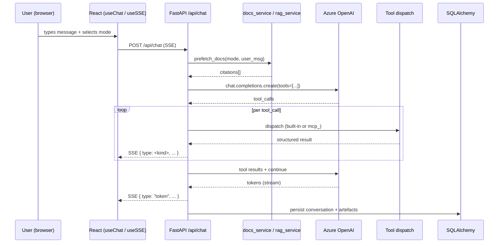
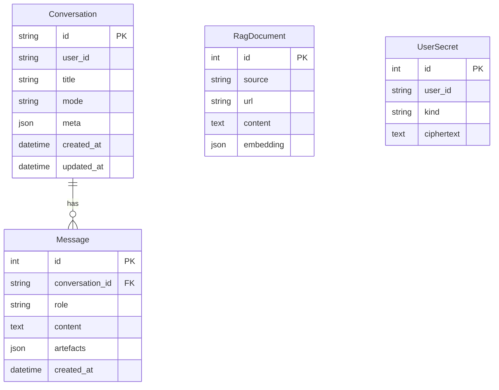
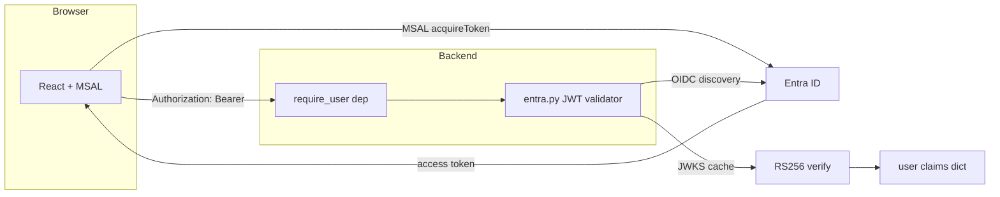
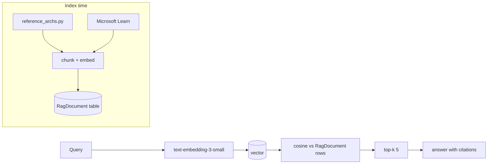
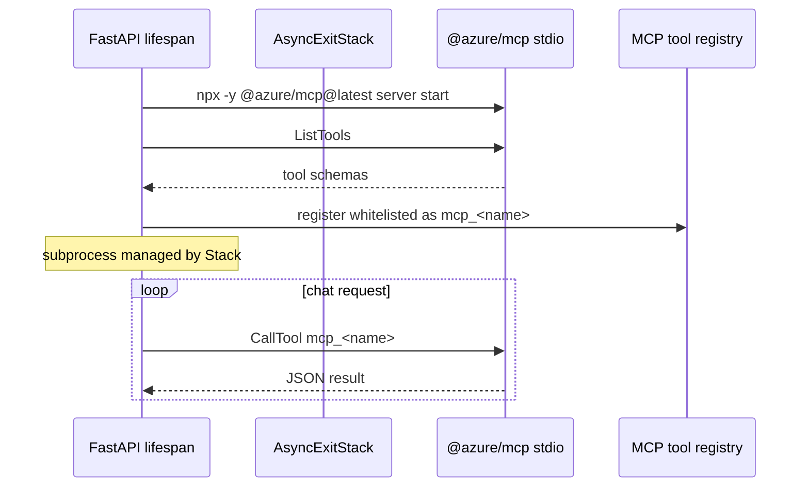
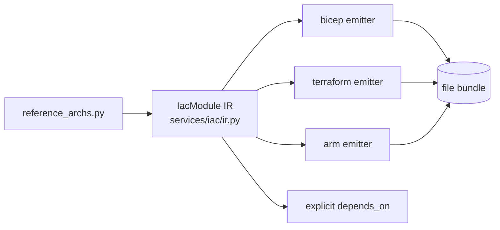

# Architecture

System architecture, data flow, auth, and observability for Azure Architect AI.

## Components

```mermaid
flowchart LR
  User[Browser] -->|HTTPS| FE[React SPA<br/>Vite + Fluent UI v9]
  FE -->|fetch / SSE| BE[FastAPI backend]
  BE --> AOAI[(Azure OpenAI<br/>chat + embeddings)]
  BE --> DB[(SQLite dev /<br/>Postgres prod)]
  BE -->|spawned subprocess| MCP[@azure/mcp stdio]
  MCP --> AzAPI[Azure ARM]
  BE --> RG[Azure Resource Graph]
  BE --> CM[Cost Management API]
  BE --> POL[Policy Insights]
  BE --> DEF[Defender for Cloud]
  BE --> AI[Application Insights<br/>OTLP via Azure Monitor]
  BE --> KV[Key Vault<br/>at runtime, optional]
  FE -->|MSAL| Entra[Entra ID]
  BE -->|JWT validation| Entra
```

## Backend layout

```
backend/
  main.py                  FastAPI app, lifespan, CORS, 19 routers
  config.py                Pydantic Settings (env-driven)
  db.py                    SQLAlchemy async engine + models
  observability.py         OTel + Azure Monitor + custom metrics
  models.py                Shared request models (ModelConfig)
  auth/
    entra.py               JWT validation, require_user dependency
  middleware/
    logging.py             structlog + RequestContextMiddleware
  prompts/
    system_prompt.py       MODE_TEMPLATES dict
  routes/                  19 routers, all mounted under /api
  services/                22 service modules
    iac/                   ir.py + bicep/terraform/arm emitters
  tools/
    tool_definitions.py    TOOLS_BY_MODE (34 modes) + MCP merge
    domains/               23 domain files defining 39 tools
  tests/                   6 pytest files (23 tests)
```

## Request flow — chat



## Request flow — architecture mode

`backend/routes/architecture.py` orchestrates multiple tool calls in a fixed order to emit a complete deliverable in one SSE stream. Modes routed here: `architecture`, `waf`, `review`, `drbc`, `network`, `aiarchitecture`, `dataplatform`, `apim`.

Emitted SSE kinds (see `ARCHITECTURE.md` and `API.md`): `status`, `token`, `bicep`, `terraform_files`, `arm_files`, `cost_estimate`, `network_topology`, `waf_pillar`, `waf_complete`, `adr`, `project_timeline`, `cicd_files`, `cost_alerts`, `security_posture`, `multicloud_comparison`, `diagram`, `runbook`, `citations`, `error`.

## Data model

Defined in `backend/db.py`:



- Async engine, async sessionmaker (`sqlalchemy.ext.asyncio`)
- SQLite for dev (`aiosqlite`), Postgres for prod (`asyncpg`)
- `UserSecret.ciphertext` encrypted with Fernet via `services/secret_store.py`
- Alembic config at repo root (`alembic.ini`)

## Auth



When `AUTH_ENABLED=false`, `require_user` short-circuits to `{"sub":"default"}` and the JWKS client never initializes (`backend/auth/entra.py:127`). This makes local dev a no-op.

When `AUTH_ENABLED=true`:

1. SPA acquires a token from Entra via MSAL for the API scope.
2. Each request to `/api/*` carries `Authorization: Bearer <jwt>`.
3. `entra.py` lazily initializes `PyJWKClient` against `https://login.microsoftonline.com/<tenant>/discovery/v2.0/keys`.
4. Token validation checks signature (RS256), issuer, audience, expiry.
5. Claims dict is propagated via `user_id_from_claims()`.

## RAG



- Embeddings stored as JSON in `RagDocument.embedding`
- Pure-Python cosine sim (`services/rag_service.py`)
- Pre-warmed at startup (`backend/main.py:42`)
- Cached: `cached_learn_search` decorates `docs_service.search_azure_docs`
- pgvector migration — not yet implemented

## MCP integration



The whitelist (`_WHITELIST` in `services/mcp_service.py`) keeps the catalog focused; only informational/guidance MCP tools are merged in for `_MCP_ENABLED_MODES`.

## Observability

`backend/observability.py:configure_telemetry` wires `azure-monitor-opentelemetry` when `APPLICATIONINSIGHTS_CONNECTION_STRING` is set.

Instrumented:
- FastAPI (auto)
- httpx (auto, propagates trace context to AOAI calls)
- SQLAlchemy (auto)

Custom counters:
- `aa_tool_calls_total{tool,mode}` — every tool dispatch
- `aa_openai_tokens_used{deployment,kind}` — prompt + completion tokens
- `aa_rag_cache_hit_latency_ms` — RAG lookup latency histogram

Logging:
- `middleware/logging.py:configure_logging` sets up structlog JSON
- `RequestContextMiddleware` attaches `request_id` + `user_id` to log records

## IaC subsystem



`IacModule` (`services/iac/ir.py:38`) carries parameters, resources, outputs, notes. `SERVICE_CATALOG` (`ir.py:54`) maps human service labels to `(azure_type, default_sku)` tuples (25 services as of writing). Architectures lacking a catalog entry are reported in `module.notes`.

The Bicep path is LLM-prompt-driven today; Terraform and ARM are template-driven from the IR.

## Frontend layout

```
frontend/
  src/
    components/    31 components
      chat/        message list, structured cards, citation chips
      architecture/ canvas + diagram embed
      iac/         tabs + copy buttons
      cost/        cost table
      auth/        AuthGate, AuthProvider, msalConfig
      settings/    SettingsPanel
    hooks/         useChat, useSSE, useSettings, ...
    utils/         16 helpers (exports, clipboard, parsing)
    pages/         routes
    main.tsx
  vite.config.ts
  vitest.config.ts (4 test files, 7 tests)
```

The `useChat` hook (`frontend/src/hooks/useChat.ts`) drives the chat experience; `useSSE` parses `text/event-stream` frames into typed events that flow into `useChat`'s state machine.

## CORS

`backend/main.py:54` allows `http://localhost:5173` and `http://localhost:3000` with credentials. Production deployments serving the SPA behind Front Door collapse the cross-origin concern.

## Threading model

FastAPI is async end-to-end. Blocking calls (e.g. some pricing lookups) are wrapped with `asyncio.to_thread` where necessary. SSE responses use `StreamingResponse(media_type="text/event-stream")` returning an async generator.
