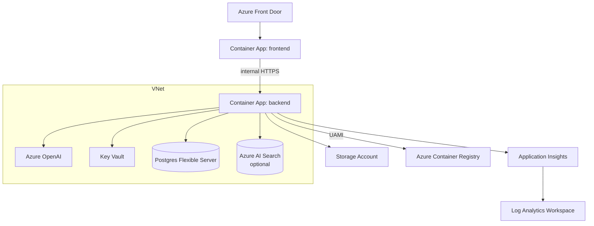

# Deployment

How to deploy Azure Architect AI to Azure Container Apps using the bundled Bicep and GitHub Actions workflows.

## Environments

| Env | Branch | Resource group | Frontend URL | Deployment name | Param file |
|---|---|---|---|---|---|
| **prod** | `main` | `aarch-dev-rg` | `https://blueprint.techtools.host` | `aarch-dev` | `infra/main.bicepparam` |
| **test** | `dev` | `aarch-test-rg` | `https://dev.blueprint.techtools.host` | `aarch-test` | `infra/main.test.bicepparam` |

Both envs share the AOAI account (`aarch-dev-aoai`) and ACR (`aarchdevacr`) that live in `aarch-dev-rg`. The test stack sets `deployOpenAi=false` and `deployAcr=false`; cross-RG role assignments come from `infra/modules/openai-grant.bicep` and `infra/modules/acr-grant.bicep`.

## Target topology

Subscription-scope Bicep deploys a resource group (`<prefix>-<env>-rg`) containing 13 module deployments (`infra/main.bicep`):



Modules deployed (`infra/main.bicep:74`-`290`):

| Module | File | Purpose |
| --- | --- | --- |
| identity | `infra/modules/identity.bicep` | User-assigned managed identity |
| network | `infra/modules/network.bicep` | VNet + 3 subnets + private DNS zones |
| acr | `infra/modules/containerregistry.bicep` | Premium ACR + AcrPull role assignment |
| kv | `infra/modules/keyvault.bicep` | Key Vault + private endpoint |
| storage | `infra/modules/storage.bicep` | Storage account + Azure Files share |
| openai | `infra/modules/openai.bicep` | Azure OpenAI account + model deployments |
| postgres | `infra/modules/postgres.bicep` | Flexible Server + private DNS |
| monitoring | `infra/modules/monitoring.bicep` | Log Analytics + App Insights + alerts |
| search | `infra/modules/search.bicep` | Optional AI Search (`deploySearch=true`) |
| acaEnv | `infra/modules/containerapps-env.bicep` | Container Apps env + file share |
| backendApp | `infra/modules/containerapp.bicep` | Backend container app |
| frontendApp | `infra/modules/containerapp.bicep` | Frontend container app |
| frontdoor | `infra/modules/frontdoor.bicep` | Optional Front Door (`deployFrontDoor=true`) |

## Manual deploy

```bash
# 1. Sign in
az login
az account set --subscription <SUBSCRIPTION_ID>

# 2. Create parameters file
cp infra/main.bicepparam.example infra/main.bicepparam   # if present, or author by hand
# Required parameters: prefix, postgresAdminPassword, oncallEmail

# 3. What-if (preview)
az deployment sub what-if \
  --name main \
  --location eastus2 \
  --template-file infra/main.bicep \
  --parameters infra/main.bicepparam

# 4. Apply
az deployment sub create \
  --name main \
  --location eastus2 \
  --template-file infra/main.bicep \
  --parameters infra/main.bicepparam

# 5. Capture outputs
az deployment sub show -n main --query properties.outputs -o json
```

Key outputs (see `infra/main.bicep:269`-`279`):

- `resourceGroupName`
- `frontendUrl` — internal Container App FQDN
- `frontDoorHostname` — public hostname when `deployFrontDoor=true`
- `acrLoginServer`
- `managedIdentityClientId`
- `keyVaultName`
- `openAiEndpoint`
- `postgresFqdn`
- `appInsightsConnectionString`

## Build and push images

Initial bootstrap uses `mcr.microsoft.com/azuredocs/aci-helloworld:latest` (see `infra/main.bicep:45`, `:48`). After the RG exists, build real images via ACR Tasks:

```bash
ACR=$(az deployment sub show -n main --query properties.outputs.acrLoginServer.value -o tsv | cut -d. -f1)

az acr build -r $ACR -t aa-backend:latest  -f backend/Dockerfile.prod  ./backend
az acr build -r $ACR -t aa-frontend:latest -f frontend/Dockerfile.prod ./frontend
```

Then redeploy with the real `backendImage` / `frontendImage` parameters, or update the container apps directly:

```bash
az containerapp update -g <RG> -n <BACKEND_APP>  --image $ACR.azurecr.io/aa-backend:latest
az containerapp update -g <RG> -n <FRONTEND_APP> --image $ACR.azurecr.io/aa-frontend:latest
```

## GitHub Actions workflows

Three workflows live under `.github/workflows/`. All use OIDC federated credentials (`permissions: id-token: write`). Configure these repository secrets first:

| Secret | Purpose |
| --- | --- |
| `AZURE_CLIENT_ID` | Federated app registration |
| `AZURE_TENANT_ID` | Entra tenant |
| `AZURE_SUBSCRIPTION_ID` | Target subscription |

And these GitHub environments:

- `dev` / `dev-apply` — used by deploys to **prod** (`main` branch → `aarch-dev-rg`); `dev-apply` gates `infra.yml` apply with required reviewers.
- `test` / `test-apply` — used by deploys to **test** (`dev` branch → `aarch-test-rg`); `test-apply` likewise.

The branch-aware `setenv` job in both workflows picks the correct env, RG, deployment name, and param file from `github.ref` (push) or `github.base_ref` (PR).

### `ci.yml` — pull request CI

`.github/workflows/ci.yml` (62 lines). Runs on every PR and on `main` pushes.

Jobs:
- **backend**: ruff lint, mypy (non-failing), pytest (non-failing)
- **frontend**: `tsc --noEmit`, `npm run build`
- **images**: builds both `Dockerfile.prod` images (no push)

### `infra.yml` — Bicep what-if + apply

`.github/workflows/infra.yml`. Triggers on `infra/**` changes on `main` or `dev`.

- PR: `az deployment sub what-if` with `FullResourcePayloads` (against the **base branch's** param file).
- Push: `az deployment sub create` (gated by `<env>-apply` environment).

### `deploy.yml` — image build + revision update

`.github/workflows/deploy.yml`. Triggers on `backend/**` or `frontend/**` changes on `main` or `dev`, or `workflow_dispatch`.

Jobs:
- **setenv**: picks env-specific outputs (deployment name, RG fallback, param file, GH env) from `github.ref`.
- **detect**: paths-filter + reads ACR / RG / app names from the env's subscription deployment outputs, with fallback to direct lookup (and ultimately to the shared dev ACR for the test env).
- **backend**: `az acr build` of `backend/Dockerfile.prod` then `az containerapp update --image ... --revision-suffix sha-<SHA>-r<run_number>`.
- **frontend**: same, for frontend. Vite env vars (`VITE_ENTRA_*`, `VITE_UNIFIED_AGENTS`) are baked into the image via `--build-arg`.
- **smoke**: HTTP 200 check on `frontendUrl` (5 retries, 10s apart). Custom domain wins over default FQDN when one is bound.

## Custom domains

Each env's frontend has a managed TLS cert bound to a custom hostname:

| Env | Hostname | Cert (ACA env) |
|---|---|---|
| prod | `blueprint.techtools.host` | `aarch-dev-cae` / `blueprint.techtools.host-aarch-de-…` |
| test | `dev.blueprint.techtools.host` | `aarch-test-cae` / `dev.blueprint.techtools.host-aarch-te-…` |

Bindings are declared in the env's bicepparam (`frontendCustomDomains`), so re-applying Bicep preserves them. Cert provisioning itself is a one-time manual step:

```bash
# DNS first — CNAME the hostname to <app>.<env-suffix>.<region>.azurecontainerapps.io
az containerapp env certificate create -g <RG> -n <CAE_NAME> \
  --hostname dev.blueprint.techtools.host \
  --validation-method CNAME
# wait for provisioningState=Succeeded, then bind
az containerapp hostname bind -g <RG> -n <FRONTEND_APP> \
  --hostname dev.blueprint.techtools.host \
  --environment <CAE_NAME> \
  --certificate <CERT_ID>
# finally, copy the cert ID into the env's bicepparam frontendCustomDomains[]
```

## Entra ID (two app registrations)

Auth uses two app regs in tenant `16b3c013-d300-468d-ac64-7eda0820b6d3`:

| App | Client ID | Purpose |
|---|---|---|
| `azure-architect-ai-api` | `5e5c9491-d850-4f1b-9d67-939824a4c819` | API resource. Backend validates `aud == api://5e5c9491…`. Exposes `Metrics.Read` app role + `access_as_user` delegated scope. |
| `azure-architect-ai-spa` | `e9616e6b-3c8b-4153-b814-b01817c9ade2` | SPA client. Holds redirect URIs. `requiredResourceAccess` points at the API's `access_as_user` scope. |

Critical: **`VITE_ENTRA_API_SCOPE` must be `api://5e5c9491…/access_as_user`** (the API app), not the SPA's own URI. Pointing it at the SPA's URI mints tokens with the wrong `aud` and the backend will 401 with `Invalid audience`.

Per-env redirect URIs on the SPA app:
- `https://blueprint.techtools.host/` (prod)
- `https://dev.blueprint.techtools.host/` (test)
- ACA default FQDNs for direct access

## Auth at runtime

- Both container apps run with the same user-assigned managed identity (`infra/modules/identity.bicep`).
- The UAMI receives: `AcrPull` on ACR (`containerregistry.bicep`), `Key Vault Secrets User` on KV (`keyvault.bicep`), `Cognitive Services OpenAI User` on AOAI (`openai.bicep`).
- The backend image must run with `AZURE_CLIENT_ID` env var set to the UAMI client ID so `DefaultAzureCredential` picks it. The Bicep sets this automatically (`infra/main.bicep:224`).

## Observability

- `applicationinsights_connection_string` is wired from the `monitoring` module and consumed by `backend/observability.py` (`configure_telemetry`).
- Custom counters: `aa_tool_calls_total`, `aa_openai_tokens_used`, `aa_rag_cache_hit_latency_ms`.
- Alerts in `infra/modules/monitoring.bicep` page `oncallEmail`.

## Weekly content ingests (prod)

Two weekly APScheduler jobs (`backend/services/scheduler.py`) refresh the Reference Architecture and Demo Showcase libraries:

- `refarch_ingest_weekly` — Sun 04:17, Microsoft Learn ContentBrowser
- `demo_ingest_weekly` — Sun 04:42, `Azure/awesome-azd`

To enable them in prod, set `INGEST_ENABLED=true` on the **backend** container app. Both jobs run inside the backend process — no separate worker. To seed immediately after a fresh deploy (without waiting for Sunday), hit the admin endpoints with a token whose JWT carries the `Metrics.Read` app role:

```bash
TOKEN=$(az account get-access-token --resource api://<API_APP_ID> --query accessToken -o tsv)
curl -X POST https://<frontend-fqdn>/api/refarch/ingest -H "Authorization: Bearer $TOKEN"
curl -X POST https://<frontend-fqdn>/api/demos/ingest   -H "Authorization: Bearer $TOKEN"
```

Both endpoints return summary counts (`inserted`, `updated`, `unchanged`, `skipped`) and the `Metrics.Read` role must be assigned to the calling user/principal on the API app registration. Curated rows are upserted by stable id; user-toggled `featured` flags and any `custom`-sourced rows are preserved across runs.

## Roll back

Container Apps keeps prior revisions:

```bash
az containerapp revision list -g <RG> -n <APP> -o table
az containerapp ingress traffic set -g <RG> -n <APP> --revision-weight <prev>=100 <new>=0
```

For infra rollbacks, re-run the previous `infra.yml` apply by reverting the commit on `main`.

## Hardening checklist (roadmap)

- Private endpoints on every PaaS service (Key Vault and OpenAI already private; ACR + Storage need extension — not yet implemented)
- Network policies on the ACA environment (currently default VNet-injected)
- WAF policy attached to Front Door (Front Door deployed; WAF policy attachment not yet implemented)
- Auth enabled by default in prod parameters file (`AUTH_ENABLED` currently env-driven)
