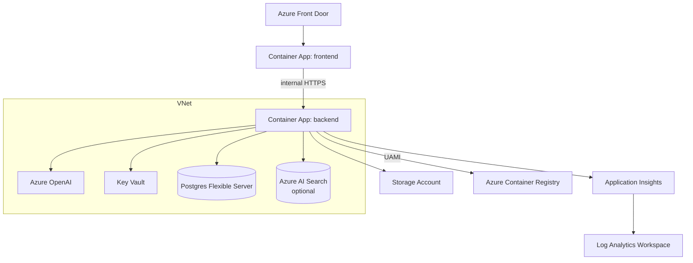

# Deployment

How to deploy Azure Architect AI to Azure Container Apps using the bundled Bicep and GitHub Actions workflows.

## Target topology

Subscription-scope Bicep deploys a single resource group (`<prefix>-<env>-rg`) containing 13 module deployments (`infra/main.bicep`):



Modules deployed (`infra/main.bicep:74`-`290`):

| Module | File | Purpose |
| --- | --- | --- |
| identity | `infra/modules/identity.bicep` | User-assigned managed identity |
| network | `infra/modules/network.bicep` | VNet + 3 subnets + private DNS zones |
| acr | `infra/modules/containerregistry.bicep` | Premium ACR + AcrPull role assignment |
| kv | `infra/modules/keyvault.bicep` | Key Vault + private endpoint |
| storage | `infra/modules/storage.bicep` | Storage account + Azure Files share |
| openai | `infra/modules/openai.bicep` | Azure OpenAI account + model deployments |
| postgres | `infra/modules/postgres.bicep` | Flexible Server + private DNS |
| monitoring | `infra/modules/monitoring.bicep` | Log Analytics + App Insights + alerts |
| search | `infra/modules/search.bicep` | Optional AI Search (`deploySearch=true`) |
| acaEnv | `infra/modules/containerapps-env.bicep` | Container Apps env + file share |
| backendApp | `infra/modules/containerapp.bicep` | Backend container app |
| frontendApp | `infra/modules/containerapp.bicep` | Frontend container app |
| frontdoor | `infra/modules/frontdoor.bicep` | Optional Front Door (`deployFrontDoor=true`) |

## Manual deploy

```bash
# 1. Sign in
az login
az account set --subscription <SUBSCRIPTION_ID>

# 2. Create parameters file
cp infra/main.bicepparam.example infra/main.bicepparam   # if present, or author by hand
# Required parameters: prefix, postgresAdminPassword, oncallEmail

# 3. What-if (preview)
az deployment sub what-if \
  --name main \
  --location eastus2 \
  --template-file infra/main.bicep \
  --parameters infra/main.bicepparam

# 4. Apply
az deployment sub create \
  --name main \
  --location eastus2 \
  --template-file infra/main.bicep \
  --parameters infra/main.bicepparam

# 5. Capture outputs
az deployment sub show -n main --query properties.outputs -o json
```

Key outputs (see `infra/main.bicep:269`-`279`):

- `resourceGroupName`
- `frontendUrl` — internal Container App FQDN
- `frontDoorHostname` — public hostname when `deployFrontDoor=true`
- `acrLoginServer`
- `managedIdentityClientId`
- `keyVaultName`
- `openAiEndpoint`
- `postgresFqdn`
- `appInsightsConnectionString`

## Build and push images

Initial bootstrap uses `mcr.microsoft.com/azuredocs/aci-helloworld:latest` (see `infra/main.bicep:45`, `:48`). After the RG exists, build real images via ACR Tasks:

```bash
ACR=$(az deployment sub show -n main --query properties.outputs.acrLoginServer.value -o tsv | cut -d. -f1)

az acr build -r $ACR -t aa-backend:latest  -f backend/Dockerfile.prod  ./backend
az acr build -r $ACR -t aa-frontend:latest -f frontend/Dockerfile.prod ./frontend
```

Then redeploy with the real `backendImage` / `frontendImage` parameters, or update the container apps directly:

```bash
az containerapp update -g <RG> -n <BACKEND_APP>  --image $ACR.azurecr.io/aa-backend:latest
az containerapp update -g <RG> -n <FRONTEND_APP> --image $ACR.azurecr.io/aa-frontend:latest
```

## GitHub Actions workflows

Three workflows live under `.github/workflows/`. All use OIDC federated credentials (`permissions: id-token: write`). Configure these repository secrets first:

| Secret | Purpose |
| --- | --- |
| `AZURE_CLIENT_ID` | Federated app registration |
| `AZURE_TENANT_ID` | Entra tenant |
| `AZURE_SUBSCRIPTION_ID` | Target subscription |

And these GitHub environments:

- `dev` — used by `deploy.yml`
- `dev-apply` — used by `infra.yml` apply job; gate with required reviewers

### `ci.yml` — pull request CI

`.github/workflows/ci.yml` (62 lines). Runs on every PR and on `main` pushes.

Jobs:
- **backend**: ruff lint, mypy (non-failing), pytest (non-failing)
- **frontend**: `tsc --noEmit`, `npm run build`
- **images**: builds both `Dockerfile.prod` images (no push)

### `infra.yml` — Bicep what-if + apply

`.github/workflows/infra.yml` (61 lines). Triggers on `infra/**` changes.

- PR: `az deployment sub what-if` with `FullResourcePayloads`
- `main` push or manual dispatch: `az deployment sub create` (gated by `dev-apply` environment)

### `deploy.yml` — image build + revision update

`.github/workflows/deploy.yml` (133 lines). Triggers on `backend/**` or `frontend/**` changes.

Jobs:
- **detect**: paths-filter + reads ACR / RG / app names from the `main` subscription deployment outputs
- **backend**: `az acr build` of `backend/Dockerfile.prod` then `az containerapp update --image ... --revision-suffix sha-<SHA>`
- **frontend**: same, for frontend
- **smoke**: HTTP 200 check on `frontendUrl` (5 retries, 10s apart)

## Auth at runtime

- Both container apps run with the same user-assigned managed identity (`infra/modules/identity.bicep`).
- The UAMI receives: `AcrPull` on ACR (`containerregistry.bicep`), `Key Vault Secrets User` on KV (`keyvault.bicep`), `Cognitive Services OpenAI User` on AOAI (`openai.bicep`).
- The backend image must run with `AZURE_CLIENT_ID` env var set to the UAMI client ID so `DefaultAzureCredential` picks it. The Bicep sets this automatically (`infra/main.bicep:224`).

## Observability

- `applicationinsights_connection_string` is wired from the `monitoring` module and consumed by `backend/observability.py` (`configure_telemetry`).
- Custom counters: `aa_tool_calls_total`, `aa_openai_tokens_used`, `aa_rag_cache_hit_latency_ms`.
- Alerts in `infra/modules/monitoring.bicep` page `oncallEmail`.

## Roll back

Container Apps keeps prior revisions:

```bash
az containerapp revision list -g <RG> -n <APP> -o table
az containerapp ingress traffic set -g <RG> -n <APP> --revision-weight <prev>=100 <new>=0
```

For infra rollbacks, re-run the previous `infra.yml` apply by reverting the commit on `main`.

## Hardening checklist (roadmap)

- Private endpoints on every PaaS service (Key Vault and OpenAI already private; ACR + Storage need extension — not yet implemented)
- Network policies on the ACA environment (currently default VNet-injected)
- WAF policy attached to Front Door (Front Door deployed; WAF policy attachment not yet implemented)
- Auth enabled by default in prod parameters file (`AUTH_ENABLED` currently env-driven)
